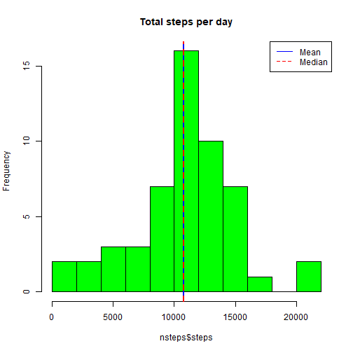
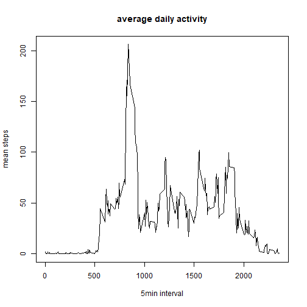
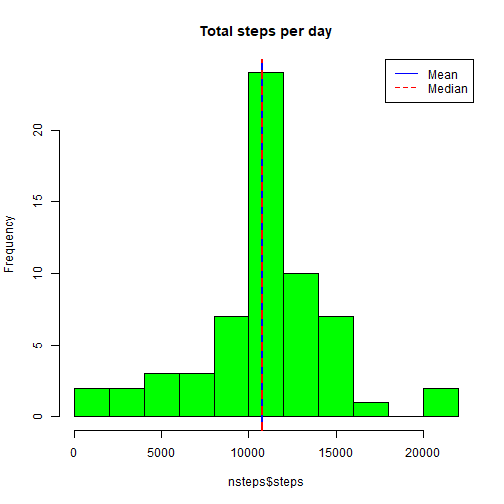
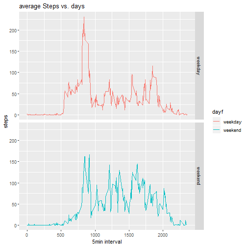

Reproducible Research Project1
==============================
# Loading and preprocessing the data

```r
    url = "https://d396qusza40orc.cloudfront.net/repdata%2Fdata%2Factivity.zip"
    download.file(url, "Activity monitoring data.zip")
    unzip("Activity monitoring data.zip")
    mydata = read.csv("activity.csv")
    names(mydata)
```

```
## [1] "steps"    "date"     "interval"
```

## Process/transform the data (if necessary) into a format suitable for your analysis

```r
    mydata$date <- as.Date(mydata$date, "%Y-%m-%d")
```

# What is mean and median of the total number of steps taken per day?
## plot histogram with mean and median lines added

```r
    nsteps = aggregate(steps ~ date, mydata, FUN=sum, na.rm=T)
    mean(nsteps$steps)
```

```
## [1] 10766.19
```

```r
    median(nsteps$steps)
```

```
## [1] 10765
```

```r
    hist(nsteps$steps, breaks = 10, col="green", main="Total steps per day")
    abline(v=mean(nsteps$steps), lty=1,lwd=2, col="blue")
    abline(v=median(nsteps$steps), lty=2,lwd=2, col="red")
    legend("topright",lty=c(1,2),col=c("blue","red"),legend=c("Mean","Median"))
```


Mean and median of the total number of steps taken per day 10766.19 and 10765.


# What is the average daily activity pattern?
## line plot with interval and steps

```r
    meanInt = aggregate(steps ~ interval, mydata, FUN = mean, na.rm=T)
    plot(meanInt$interval,meanInt$steps,type="l",xlab="5min interval",ylab="mean steps",main="average daily activity")
```



```r
    meanInt[which.max(meanInt$steps),]
```

```
##     interval    steps
## 104      835 206.1698
```
On average across all the days in the dataset, the 835 interval contains the maximum number of steps.

# Imputing missing values
## Calculate and report the total number of missing values in the dataset (i.e. the total number of rows with NAs)

```r
    nrow(mydata[is.na(mydata$steps),])
```

```
## [1] 2304
```

## Devise a strategy for filling in all of the missing values in the dataset. The strategy does not need to be sophisticated. For example, you could use the mean/median for that day, or the mean for that 5-minute interval, etc.

```r
    NAdata = mydata[is.na(mydata$steps),]    
    NAdata$steps[NAdata$interval==meanInt$interval]= meanInt$steps
```

## Create a new dataset that is equal to the original dataset but with the missing data filled in.

```r
    gooddata = mydata[!is.na(mydata$steps),]
    newdata = rbind(NAdata,gooddata)
```

## Make a histogram of the total number of steps taken each day and Calculate and report the mean and median total number of steps taken per day. 

```r
    nsteps = aggregate(steps ~ date, newdata, FUN=sum, na.rm=T)
    mean(nsteps$steps)
```

```
## [1] 10766.19
```

```r
    median(nsteps$steps)
```

```
## [1] 10766.19
```

```r
    hist(nsteps$steps, breaks = 10, col="green", main="Total steps per day")
    abline(v=mean(nsteps$steps), lty=1,lwd=2, col="blue")
    abline(v=median(nsteps$steps), lty=2,lwd=2, col="red")
    legend("topright",lty=c(1,2),col=c("blue","red"),legend=c("Mean","Median"))
```


The mean and median total number of steps taken per day changed to be the same after imputing missing data on the estimates of the total daily number of steps.

# Are there differences in activity patterns between weekdays and weekends?
## Create a new factor variable in the dataset with two levels – “weekday” and “weekend” indicating whether a given date is a weekday or weekend day.

```r
    newdata$dayf <- ifelse(weekdays(newdata$date) %in% c("Saturday","Sunday"),"weekend","weekday")
```

## Make a panel plot containing a time series plot (i.e. type="l") of the 5-minute interval (x-axis) and the average number of steps taken, averaged across all weekday days or weekend days (y-axis).

```r
    library(ggplot2)
    meanInt = aggregate(steps ~ interval+dayf, newdata, FUN = mean)
    g <- ggplot(meanInt, aes(interval, steps, color = dayf))
    g + geom_line() + facet_grid(dayf~.) + labs(title="average Steps vs. days", y="steps", x= "5min interval")
```


